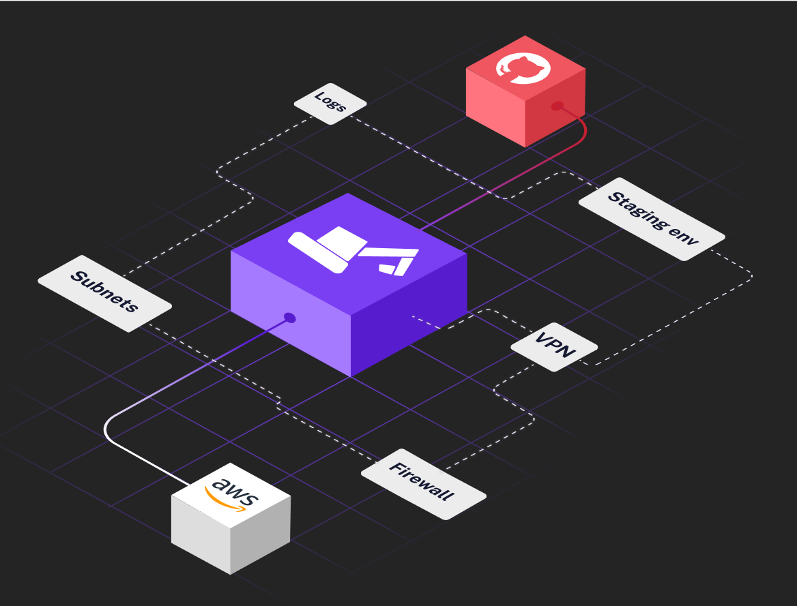

# What is this?

These are the terraform files that define your infrastructure. It was generated using [digger](https://digger.dev). These configurations files will 
help you set up your environment on AWS in no time!

# How to run it?

## On your machine
If aws cli has been configured already, no additional configuration required and following commands can be executed to view terraform plan:
```
terraform init
terraform plan
```
To create infrastructure run:
```
terraform apply
```
To destroy all infrastructure terraform created, run:
```
terraform destroy
```

If aws haven't been configured locally, the simplest option is to set env variables:
```
$ export AWS_ACCESS_KEY_ID="anaccesskey"
$ export AWS_SECRET_ACCESS_KEY="asecretkey"
$ export AWS_REGION="us-west-2"
```
More details and options can be found in terraform documentation: https://registry.terraform.io/providers/hashicorp/aws/latest/docs

## In a CI system

CI documentation coming soon

# Next steps

After you set up your infrastructure the next steps is to deploy your application. 

```
```

# Troubleshooting and getting help


